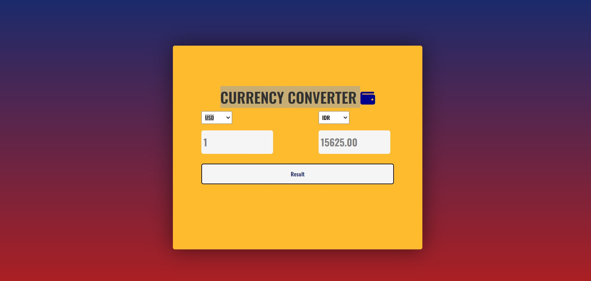

# Currenct-Converter
A simple currency converter using public API to fetch the lastest currency.  
Created with HTML, CSS, and JavaScript.

The public API adress for checking the latest currencuies rate:  
https://api.exchangerate.host/latest?base=IDR"  

JavaScript DOM and Methods usage:  
querySelector()  
querySelectorAll()  
Object.keys()  
forEach()  
toFixed()  
inner.HTML()  
addEventListener()  
parseFloat()  
